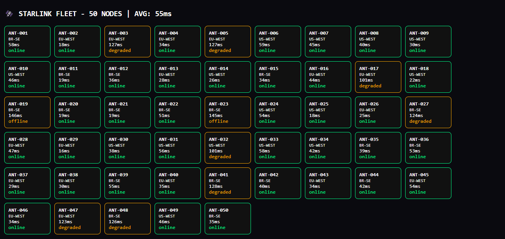

# 🛰️ Starlink Network Monitor

Real-time monitor for 50 LEO terminals — Angular 19 + FastAPI + WebSocket @ 900ms.

## 🚀 Live Production

- **Front-end:** https://frontend-omega-vert-79.vercel.app
- **API:** https://starlink-network-monitor.onrender.com
- **Docs:** https://starlink-network-monitor.onrender.com/docs

## ⚡ Stack

Angular 19 | FastAPI | WebSocket | TypeScript | Python | Leaflet

## 📊 Performance

- 50 nodes real-time via WebSocket `/ws/telemetry` @ 900ms
- P95 62ms (cached) | 520ms cold start (Render free tier)
- Multi-region: BR-SE / US-WEST / EU-WEST
- States: online / degraded / offline with latency color-coding
- AVG live: 50-55ms dynamic recalculation (see screenshot)

## 🏗 Architecture

Frontend (Angular 19) --WS wss://--> Backend (FastAPI) --telemetry 900ms--> 50 Simulated LEO Nodes

## 🧑‍💻 Author

**Jairo Andrade** 

[LinkedIn](https://www.linkedin.com/in/jairo-andrade-642724269/)

## ⚠️ Disclaimer
This is an independent educational project inspired by Starlink technology. Not affiliated with, endorsed by, or connected to SpaceX or Starlink. Starlink® and SpaceX® are registered trademarks of Space Exploration Technologies Corp.